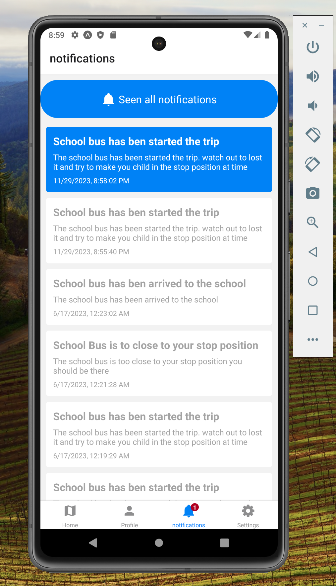
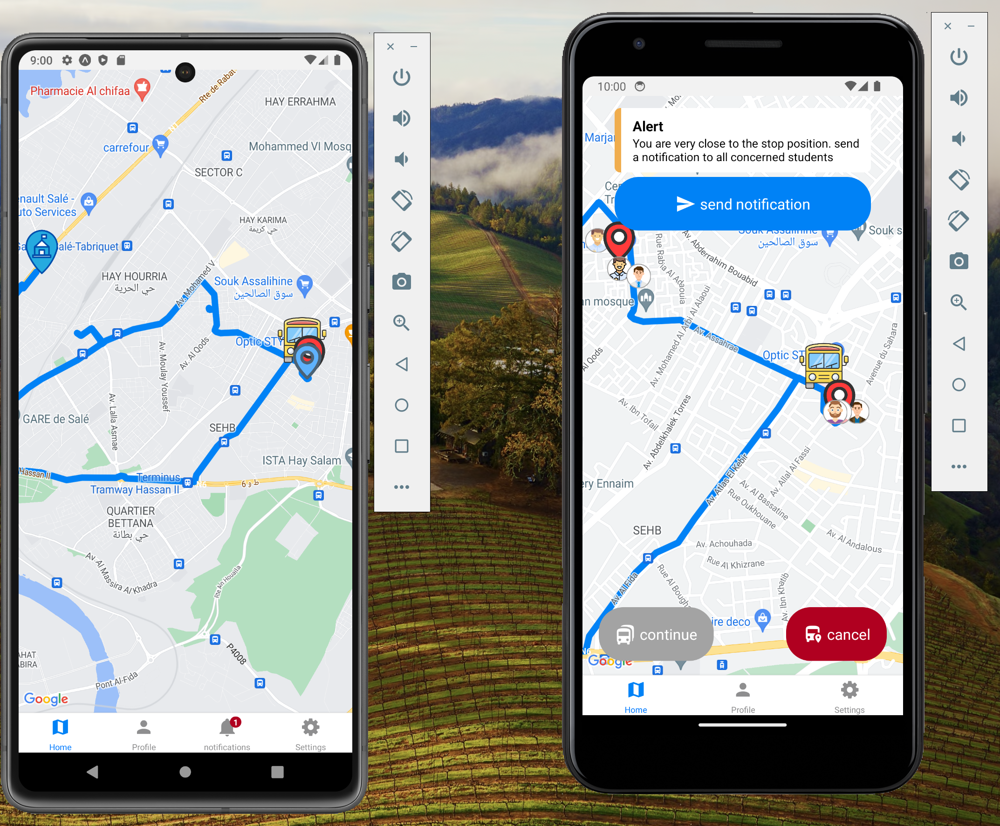
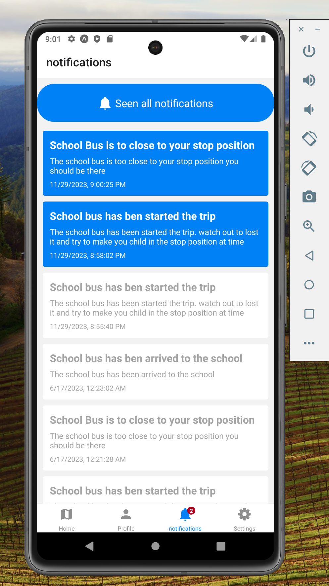
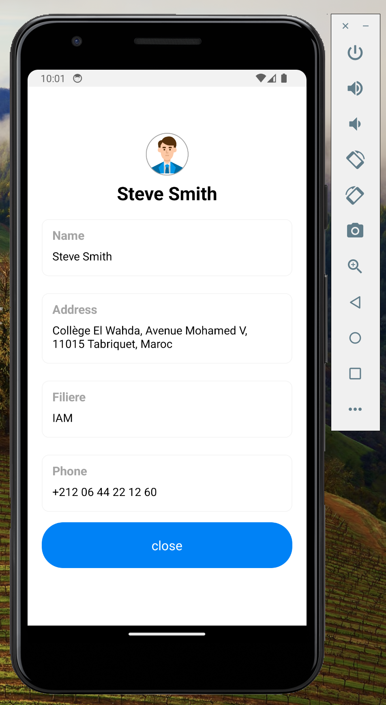
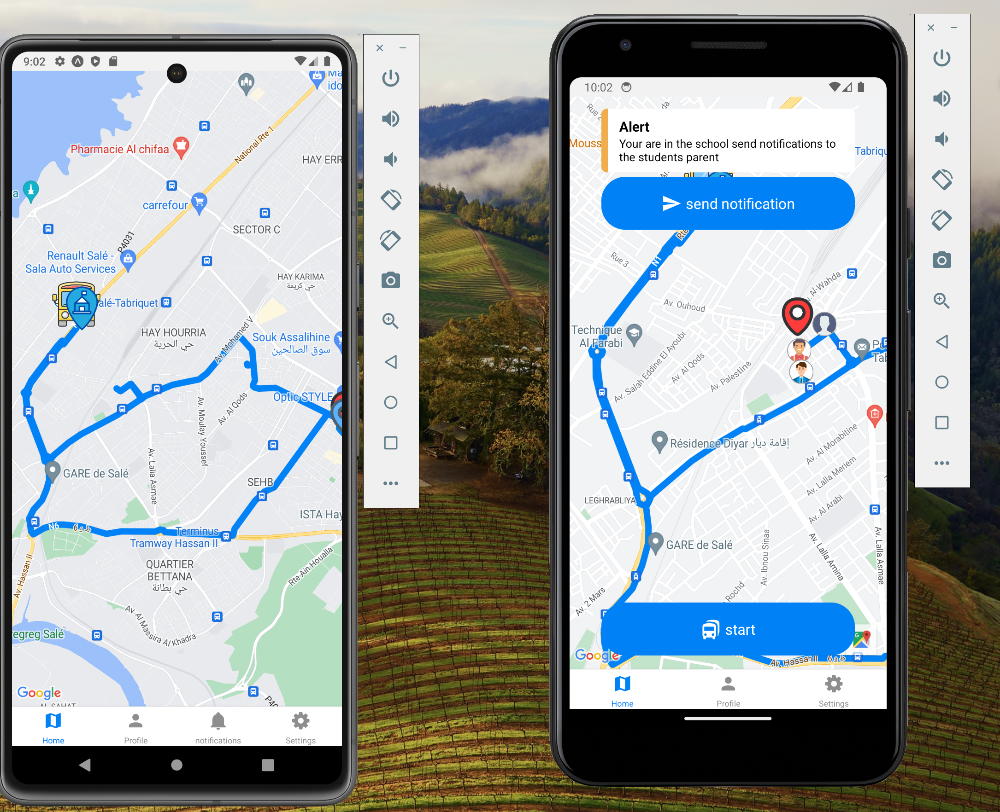
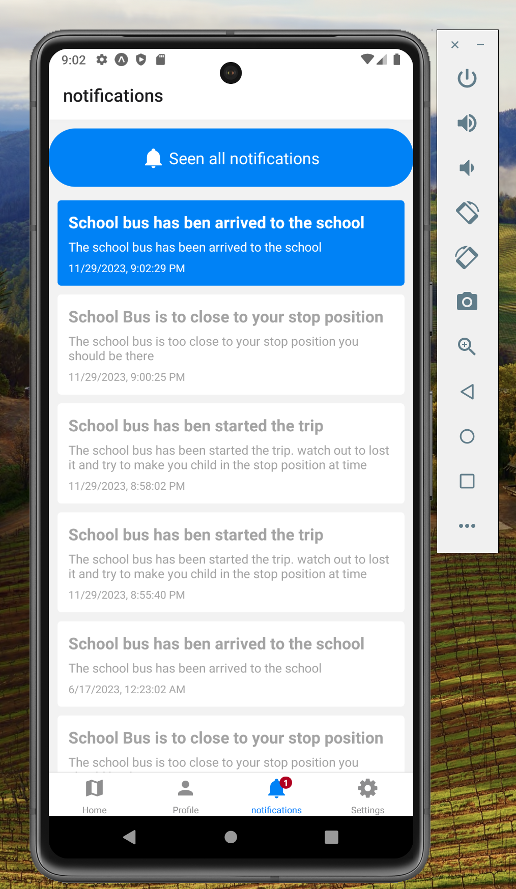

# e-school-bus

## some pictures of the app

## Getting Started

To get started with the app, follow these steps:

1. Clone the repository: `git clone https://github.com/Ayman-shaim1/e-school-bus`
2. Install dependencies: `npm install`
3. Run the app: `expo start`
ß
Please note that this app requires Node.js and Expo cli to be installed on your development machine.
